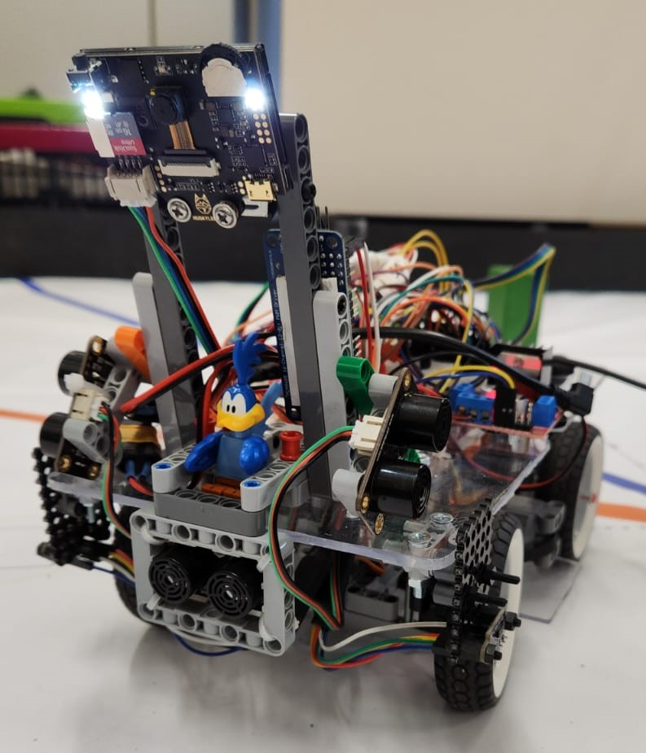

Future Engineers - Roadrunners
====

## Content

* Der Ordner `Programmcode` enthält den kompletten Programmcode, der für das Roboterauto verwendet wird.
* Im Ordner `Roboterauto` sollen sechs Fotos abgelegt werden, die das Roboterauto aus allen Richtungen zeigen.
* Im Ordner `Technische Zeichnungen` werden Zeichnungen von Komponenten des Roboterautos oder dem gesamten Roboterauto abgelegt.
* Der Ordner `Video` beinhaltet die Datei "video.md", die mit einem Link zu einem Youtube-Video befüllt werden muss. Das Video zeigt das Roboterauto beim Absolvieren des Spielfeldes.

## Einleitung

Bauanleitung:
Wir haben unser Auto aus Legoteilen und Kunststoffplatten gebaut.Wir haben in dem Buch "The Unofficial LEGO Technic Builder's Guide 2nd Edition" geguckt wie man aus LEGO ein Auto baut, speziell wie man eine Lenkung baut und wie man eine Hinterachse mit Differenzialgetriebe baut.

Größe und Gewicht:
Länge: 27cm 
Breite: 18cm
Gewicht: 1255g

Die Bodenplatte besteht aus durchsichtigem Kunststoff. Eine Zeichnung in Originalgröße mit Bohrungen haben wir dazu gelegt. 
Die Hinterachse haben wir aus Legoteilen gebaut. Eine Fotobauanleitung liegt im Verzeichnis Roboterauto: Foto_Bauanleitung.pdf.
Die Hinterachse hat ein Differenzialgetriebe damit das Auto besser um Kurven fahren kann. Zum Antrieb haben wir zwei Lego Power functions Motoren benutzt die über ein Kopplungsgetriebe mit der Hinterachse verbunden sind.
Die lenkbare Vorderachse ist ebenfalls mit Legoteilen gebaut. Siehe Foto_Bauanleitung.pdf.
Oberhalb von Hinterachse und Vorderachse haben wir eine zweite Kunststoffplatte eingebaut. Auf dieser Platte haben wir unseren Arduino, diverse Elektronik Bauteile und unseren Lego Kameraturm drauf montiert.
Bauanleitung Kameraturm: siehe Foto_Bauanleitung.pdf.
Das Akkufach befindet sich oberhalb der Hinterachse damit immer genügend Gewicht auf der Hinterachse liegt. Zusätzlich haben wir noch EV3 Kugelgewichte benutzt weil es ab und zu noch Probleme mit der Bodenhaftung gab. 

Stromversorgung:
Wir haben uns überlegt wie viel Strom und Spannung unser Auto braucht.
Spannung:
Die beiden Motoren brauchen 9V und der Arduino und der Lenkservo jeweils 5V. Der Motortreiber verbraucht nochmal 1,4V für seine Transistoren.
Strom:
Die beiden Motoren verbrauchen zusammen maximal 2.600 mA.
Der Lenkservo braucht bis zu 900 mA.
Die Kamera braucht  ca. 300 mA.
Der Arduino bracht ca. 100 mA.
Das sind zusammen bis zu 3.900 mA.
Wir brauchen also eine Batterie die mindestens 4.000 mA und mindestens 10,4V liefern kann. Dabei soll die Batterie möglichst klein und leicht sein.
Wir haben uns angeguckt was für Batterien oder Akkus in Modellbauautos normalerweise verwendet werden. Wir haben uns dann für 11,1V Lipo - Akkus entschieden.

Motorisierung: 
Wir haben 2 Powerfunctions L Lego Motoren genommen weil 1 Motor nicht genug Kraft zum Anfahren hat.
Die Motoren sind über ein Getriebe und elektrisch miteinander und mit dem Motortreiber verbunden. Dafür haben wir die Legoanschlüsse abgeschnitten und Normale Stecker angelötet. Wir haben die Motoren miteinander verbunden weil im Regelwerk steht dass man nur einen
logischen aber zwei physikalische Motoren haben darf.
Wir haben ein Diffenzialgetriebe eingebaut damit sich in der Kurve das innere Rad langsamer dreht als das äußere.
Erst haben wir gedacht das wir das Auto so schnell wie möglich zu machen und dann nachher das langsamer Fahren nur mit programmierung zu machen. Wir haben aber festgestellt das man nicht mit dem programmieren alleine das Auto langsamer
machen kann weil das Auto mindestens 130 pwm braucht um anzufahren. Und das war dann auch wieder zu schnell für unsere Sensoren. Das Auto ist so nicht ganau genug gefahren. Wir haben uns dann überlegt wie wir es schaffen
langsamer zu fahren und haben dann das Getriebe zwiachen den beiden Motoren geändert. Vorher hatten wir eine 28:28 Übersetzung, dass heißt die Hinterachse dreht sich genau so schnell wie die Motoren. Wir haben dann andere
Zahnräder eingesetzt sodass wir jetzt eine Übersetzung von 28:12 = 2,33 in der ersten Stufe an der Hinterachse haben. Dass heißt die Hinterachse dreht sich weniger als halb so schnell wie die Motoren. In der zweiten Stufe haben wir eine Übersetzung von 12:12 = 1. Das macht insgesamt eine Übersetzung von 2,33. Das heißt das sich die Motoren etwas mehr als doppelt so schnell als die Hinterachse dreht.

Sensoren:
Unsere Idee für das Eröffnungsrennen ist dass wir mit Abstandssensoren immer in der Mitte zwischen den beiden Banden steuern. Wir haben verschiedene Arten von Abstandssensoren ausprobiert.
Wir haben TOF Sensoren und Ultraschallsnsoren ausprobiert. Die TOF messen viel schneller als die Ultraschallsnsoren darum benutzen wir standartmäßig die TOF Sensoren. Die TOF Sensoren sind aber sehr empfindlich was
helles Licht angeht. Deshalb haben wir die Ultraschallsensoren trotzdem zur Sicherheit am Auto drangelassen. Man kann die Ultraschallsensoren und die TOF Snesoren ganz einfach mit einem Lego Schnellverschluss austauschen.
Um anzeigen zu können was das Auto gerade macht haben wir 3 LEDs (rot,gelb,grün) auf der obere Platte eingebaut. Wenn das Auto eingeschaltet wird geht die rote LED an. Wenn das Set-Up fertig ist und das Auto auf den
Startknopf wartet geht die rote LED aus und die gelbe geht an. Wenn der Knopf gedrückt wurde und das Auto färht los leuchtet nur noch die grüne LED. Bei der Farht leuchtet die rote LED auf wenn das Auto erkannt hat das es rechts
abbiegen muss und die gelbe wenn es erkennt das es links abbiegen muss.
Für das Hindernisrennen haben wir uns überlegt das wir einen RGB-Farbsensor benutzten der die Farben auf dem Boden erkennt. Unser Farbsensor liefert 4 Zahlen zurück: eine für rot, eine für grün, eine für blau und eine 
helligkeit. Wenn das Auto startet steht das Auto auf jedenfall auf einem weißen Untergrund und der Sensor merkt sich dann die helligkeit von dem weißen Untergrund. Wenn beim Fahren der Boden deutlich dunkler wird
hat der Sensor eine Linie gefunden und wertet dann die RGB Werte aus um rauszufinden ob es die blaue oder die orangene Linie ist.Wir haben mit verschiedenen Positionen der Ultraschallsensoren experimentiert. Wir haben festgestellt dass es besser ist das der Roboter so früh wie möglich die Messwerte erkennt. Darum haben wir die Sensoren möglichst weit vorne angebracht. Der Roboter fährt ja weiter während die Messwerte verarbeitet 

Kamera:
Als Kamera benutzen wir eine Huskylens Kamera von DF Robot. Die Huskylens ist eine Smartcam die farbige Blöcke und farbige Linien erkennen kann nachdem man sie darauf trainiert hat. Die Huskilens hat leider kein
besonders breites Sichtfeld weswegen sie manchmal Hindernisse nicht erkennt die direkt hinter der Kurve stehen. Deswegen fahren wir bei einer Kurve bis gegenüberliegenden Wand. Dann lenkt der Roboter ein und fährt rückwärts bis er die Hindernisse wieder vor sich sieht.
Danach kann er wieder seine normalen Ausweichmannöver fahren.

Vorgehensweise:
Wir haben damit angefangen uns erstmal kleine Testprogramme für die Bauteile die wir verwendet haben zu schreiben. Wir haben dafür Vorlagen von Funduino.de und von den Beispielprogrammen der Hersteller verwendet.

Die Beschreibung zu unseren Programmen findet man im README.MD im Programmcodeverzeichnis.
